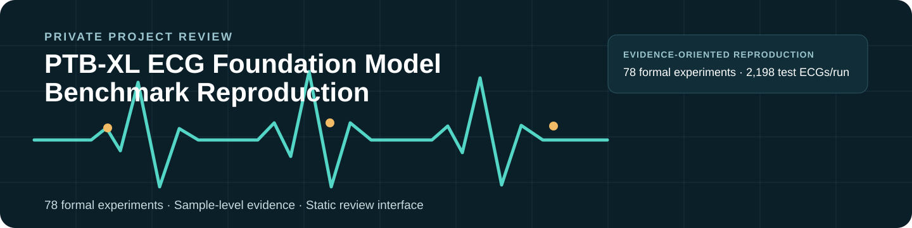
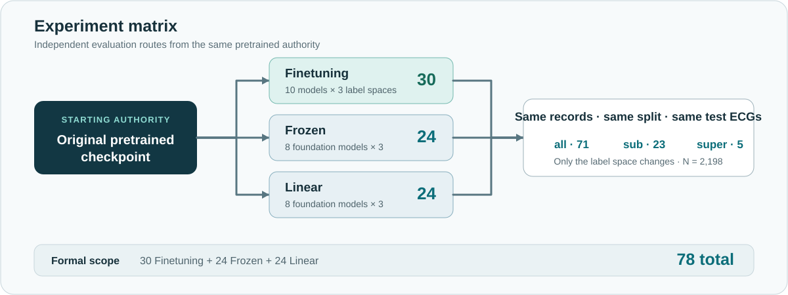
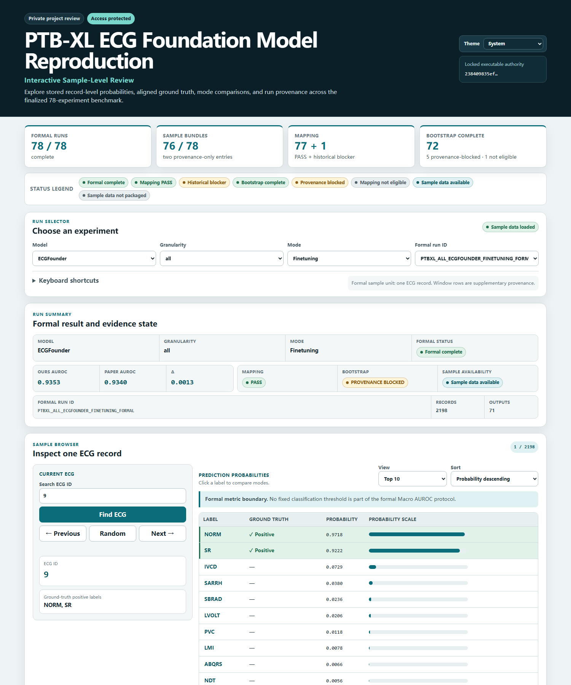
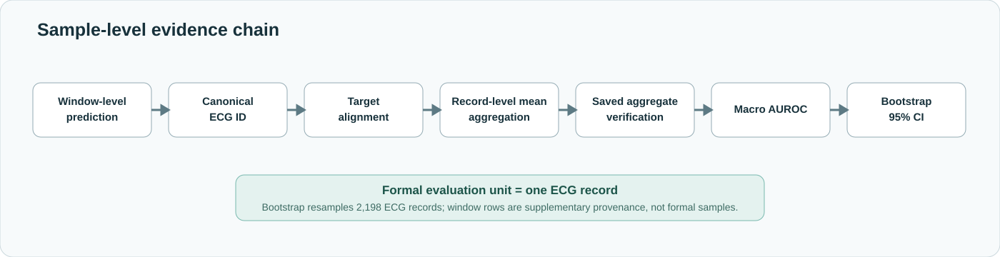

<p align="center">
  
</p>

<p align="center">
  
  
  
  
  
  
</p>

# PTB-XL ECG Foundation Model Benchmark Reproduction

A private, evidence-oriented reproduction of the PTB-XL experiments from *Benchmarking ECG FMs: A Reality Check Across Clinical Tasks*. The repository brings together the pinned executable source, final results, essential provenance, and an interactive sample-level reviewer for all **78 formal experiments**.

No training, inference, aggregation, mapping, Bootstrap, or scientific-result recomputation was performed solely for repository packaging.

## Quick Start

| Review item | Open |
|---|---|
| **Interactive Reviewer** | [**Open online reviewer**](https://ptbxl-ecg-fm-reviewer.lekang-sun.workers.dev) · Cloudflare Access protected |
| **Final Report** | [Final_Report.pdf](Final_Report.pdf) |
| **Finetuning** | [Table 3](results/tables/FINAL_TABLE3_FINETUNING.csv) |
| **Frozen** | [Table 4](results/tables/FINAL_TABLE4_FROZEN.csv) |
| **Linear** | [Table 5](results/tables/FINAL_TABLE5_LINEAR.csv) |
| **Experiment Matrix** | [Formal Run Completion Matrix](results/FORMAL_RUN_COMPLETION_MATRIX.csv) |
| **Limitations** | [Known Limitations](docs/KNOWN_LIMITATIONS.md) |

## At a Glance

| Scope | Final state |
|---|---:|
| Formal experiments | **78 / 78 complete** |
| Foundation models | **8** |
| Supervised baselines | **2** |
| Test ECGs per run | **2,198** |
| Record-level samples packaged | **76 / 78** |
| Window-level data packaged | **76 / 78** |
| Strict ECG-ID mapping | **77 PASS + 1 historical blocker** |
| Bootstrap | **72 complete / 5 provenance-blocked / 1 not eligible** |
| Worker evidence | **22 / 22 bundles · 88 / 88 SHA256** |
| Checkpoints packaged | **0** |

## Results Snapshot

| Descriptive comparison | Value |
|---|---:|
| Overall mean `|Δ|` | **0.008425** |
| Median `|Δ|` | **0.001943** |
| Maximum `|Δ|` | **0.133420** |
| Entries with `|Δ| < 0.010` | **66 / 78** |
| Top model retained | **8 / 9 panels** |

Most reproduction results closely track the paper, with larger deviations concentrated in a small number of model × mode × label-granularity settings. These are descriptive comparisons, not claims of statistical equivalence or proven root causes. The complete values remain in [Tables 3–5](results/tables/).

## Experiment Matrix

<p align="center">
  
</p>

The eight foundation models are **ECGFounder, ECG-JEPA, ST-MEM, MERL, ECGFM-KED, HuBERT-ECG, ECG-CPC, and ECG-FM**. **S4** and **Net1D** are supervised baselines and participate only in Finetuning. All three modes branch independently from the original pretrained checkpoint.

## Interactive Sample Reviewer

### [Open the Access-protected online reviewer →](https://ptbxl-ecg-fm-reviewer.lekang-sun.workers.dev)

The reviewer lets you:

- browse all 78 formal runs and 76 available sample-level bundles;
- search exact ECG IDs and inspect aligned ground truth and prediction probabilities;
- switch between top-k, all-label, and ground-truth-positive views;
- compare Finetuning, Frozen, and Linear for the same model, granularity, label, and ECG;
- inspect run provenance and qualified limitations.

<p align="center">
  <a href="https://ptbxl-ecg-fm-reviewer.lekang-sun.workers.dev">
    
  </a>
</p>

For offline review, open [`review_html/index.html`](review_html/index.html). Probability ranking is an inspection view—not a new metric—and no fixed classification threshold is part of the formal Macro AUROC protocol. Controls are documented in [`review_html/README.md`](review_html/README.md).

## Sample Data Coverage

| Representation | Coverage | Review role |
|---|---:|---|
| Formal experiment entries | **78** | Complete benchmark state |
| Physical record-level bundles | **76** | Canonical sample-inspection source |
| Metadata-only entries | **2** | Provenance-only representation |
| Window-level bundles | **76** | Supplementary provenance |

> [!NOTE]
> **Packaging limitation—not experiment failure.** Physical sample bundles are unavailable for **ECGFounder / all / Frozen** and **ECGFounder / all / Linear**. No experiment was rerun solely to reconstruct missing packaging artifacts.

The Frozen run is the sole historical mapping blocker and appears as `PROVENANCE_ONLY_LIMITED`; the Linear run has mapping PASS and appears as `PROVENANCE_ONLY`. The formal evaluation unit is one ECG record, not one signal window.

## Repository Structure

```text
README.md              project entry point
Final_Report.pdf       user-selected final report
THIRD_PARTY_NOTICES.md attribution and redistribution boundary
code/                  pinned source, overlays, scripts, configs, environments
logs/                  formal execution and final validation logs
results/               final tables and canonical result summaries
sample_predictions/    record-level bundles, window-level data, availability metadata
review_html/           static reviewer and verified inspection shards
provenance/            mapping, Bootstrap, worker, and hash evidence
manifests/             current repository file manifest
docs/                  citation, execution notes, limitations, local visuals
```

## Evidence and Reproducibility

<p align="center">
  
</p>

| Evidence area | Entry point |
|---|---|
| Formal completion | [Formal Run Completion Matrix](results/FORMAL_RUN_COMPLETION_MATRIX.csv) |
| Canonical run identity | [Canonical Run ID Map](results/CANONICAL_RUN_ID_MAP.csv) |
| Strict mapping | [Mapping Closure](provenance/mapping/MAPPING_CLOSURE_STATUS.csv) |
| Bootstrap | [Bootstrap Summary](results/BOOTSTRAP_SUMMARY.csv) |
| Training metadata | [Training Metadata](results/TRAINING_METADATA.csv) |
| Worker recovery | [22 / 22 Bundle Recovery](provenance/workers/WORKER_EVIDENCE_RECOVERY.csv) · [88 / 88 Hash Closure](provenance/workers/WORKER_HASH_CLOSURE.csv) |
| Repository integrity | [File Manifest](manifests/FILE_MANIFEST.csv) |

<details>
<summary><strong>Benchmark and evaluation contract</strong></summary>

PTB-XL v1.0.3 contains 21,799 twelve-lead ECG records from 18,869 patients at an original sampling rate of 500 Hz. Folds 1–8 are training (17,418 records), fold 9 is validation (2,183), and fold 10 is test (2,198), with no patient overlap. The all/sub/super tasks use the same records and split with output dimensions 71/23/5.

- Optimizer: AdamW; learning rate `1e-3`; weight decay `1e-3`; constant schedule
- Batch size: 64; epochs: 100; loss: BCEWithLogits
- Best checkpoint: highest validation aggregated Macro AUROC
- Primary metric: record-level aggregated Macro AUROC
- Aggregation: mean probability across windows belonging to one ECG
- Bootstrap: 1,000 iterations; 95% CI; sampling unit = ECG record; `N = 2,198`

</details>

<details>
<summary><strong>Executable authority and compatibility notes</strong></summary>

The clean source snapshot is pinned to official commit `238409835ef55358a10bbc3459dfa9aaa91ad5e5` under [`code/locked_upstream/`](code/locked_upstream/). Accepted execution compatibility work remains separate under [`code/execution_overlays/`](code/execution_overlays/) and is summarized in [Execution Notes](docs/EXECUTION_NOTES.md). It includes the ST-MEM dependency closure, ECG-CPC compatibility route, ECG-FM Python 3.9 overlay, ECG-JEPA identity aggregation, the MERL/ECGFM-KED execution-only BN guard, and emergency-worker recovery.

</details>

## Known Limitations

- Physical canonical sample bundles are packaged for **76 / 78** formal experiments.
- **ECGFounder / all / Frozen** has the sole historical strict-mapping blocker.
- Five Bootstrap states are provenance-blocked; one mapping-blocked run is not eligible.
- Checkpoint binaries are intentionally not packaged.
- Larger paper-versus-reproduction deviations are not assigned unproven causal explanations.

See the qualified [Known Limitations](docs/KNOWN_LIMITATIONS.md) for details.

## Citation and Third-Party Notice

For scientific use, cite the original paper and identify the official repository and pinned executable-authority commit. See [Citation Instructions](docs/CITATION.md) and [Third-Party Notices](THIRD_PARTY_NOTICES.md).

- **Repository visibility:** Private
- **Review scope:** Private Project Review
- **Scientific artifact recomputation required:** no
- **Raw PTB-XL dataset packaged:** no
- **Checkpoint binaries packaged:** no

This repository is not presented as a public upstream, public dataset mirror, or fully licensed open-source release.
